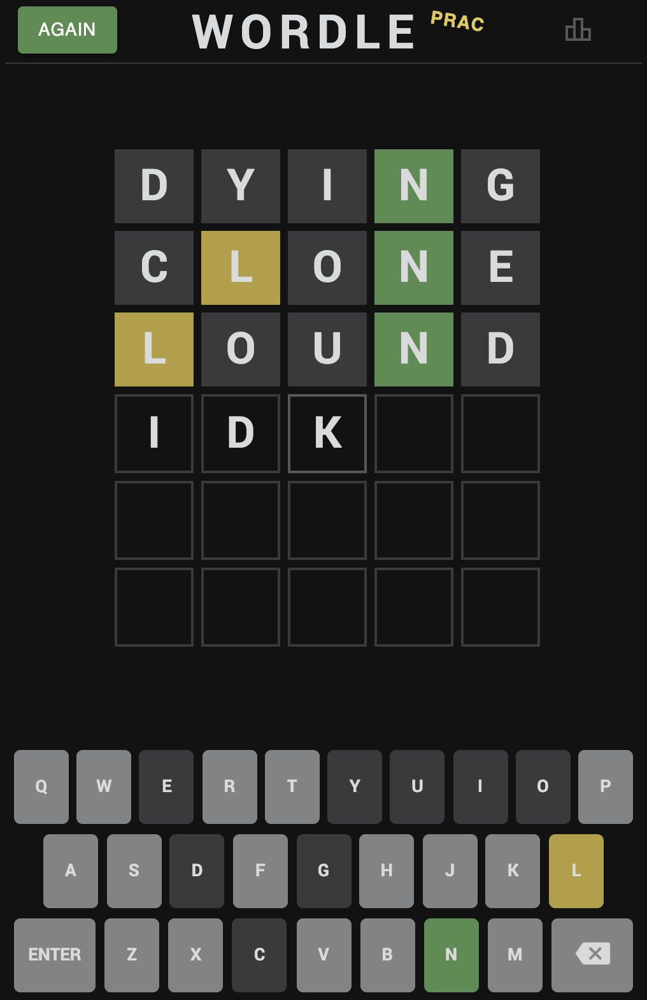
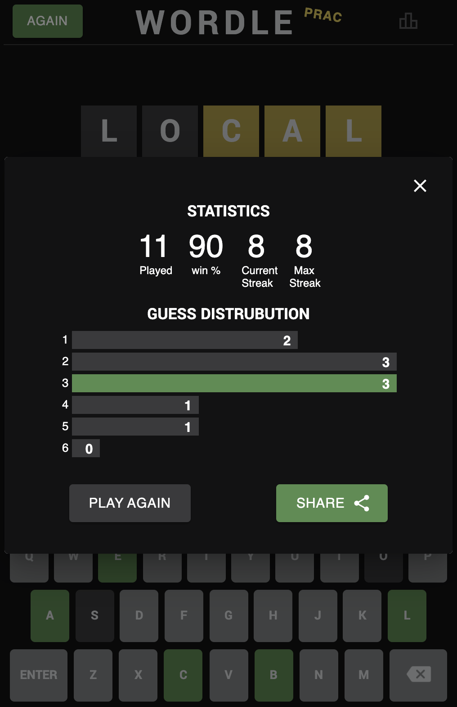

## Simple Wordle Clone

**2021 winter side project (a very small one)** 

A simple wordle clone build with React,  use Wordnik's dictionary API for vocabulary.

- #### Demo Link: https://youtu.be/Cdw9_pRy6T8

- #### What is the application about?

  A pure frontend clone of wordle, with no daily limit.

  - Includes:
    - Recreating the exact UI (components, color, size, layout...)
    - Wordnik's API: to check if word exist
    - save user's game statistics
    - Handle repeating letters
    - "Play Again" button for new gam
    - flip animation when guessing
    - vibration animation when word doesn't exist
    - Copy to share result
  - Doesn't include:
    - Jumping word when hitting the answer
    - Recover interrupted game (remember your game process)

- #### What Framework/library did I use?

  React, material-ui, axios

- #### Not deployed

